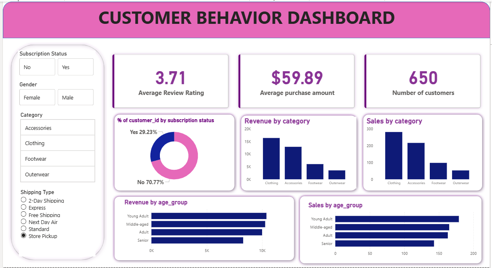

# 🛍️ Customer Shopping Behavior Analysis

This project analyzes customer shopping behavior to identify purchasing patterns, customer segments, and key factors affecting sales. The analysis uses Python, SQL, and Power BI to transform raw transactional data into meaningful insights that support data-driven business decisions.

## 📌 Project Objectives

-Analyze customer purchasing patterns

-Identify high-performing product categories

-Understand customer demographics and behavior

-Evaluate the impact of discounts and promotions

-ECreate interactive dashboards for business insights

## 📂 Dataset Features

The dataset includes customer shopping transactions with the following attributes:

-Customer ID

-Age

-Gender

-Product Category

-Item Purchased

-Purchase Amount

-Review Rating

-Discount Applied

-Promo Code Used

-Payment Method

-Purchase Frequency

-Shipping Type

Each record represents a single customer transaction.

## 🛠️ Tools & Technologies
* Tool	Purpose
* Python	Data cleaning & analysis
* Pandas / NumPy	Data manipulation
* Matplotlib / Seaborn	Data visualization
* SQL	Querying and data analysis
* Power BI	Interactive dashboards

## 🔎 Project Workflow
1️⃣ Data Cleaning

- Handled missing values

- Standardized dataset structure
 
- Prepared data for analysis

2️⃣ Exploratory Data Analysis

- Customer demographics analysis

- Category-wise purchasing trends

- Purchase frequency analysis

3️⃣ SQL Analysis

- Top-selling products

- Revenue by category

- Customer segmentation

4️⃣ Power BI Dashboard

Created an interactive dashboard showing:

- Revenue by age group

- Sales by product category

- Customer purchase frequency

- Impact of discounts and promotions

## 📊 Key Insights

* Certain age groups contribute the most to revenue.

* A few product categories dominate total sales.

* Discounts and promo codes increase purchase likelihood.

* Frequent customers generate higher revenue.

## 💡 Business Recommendations

- Target high-value customer segments with personalized marketing.

- Focus on promoting top-performing product categories.

- Use discounts strategically to increase purchase frequency.

## 📈 Dashboard Preview

  

## 🚀 Project Outcome

This project demonstrates how Python, SQL, and Power BI can be combined to analyze customer behavior and extract insights that help businesses improve marketing strategies and increase sales.
